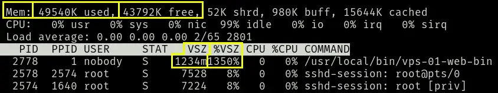
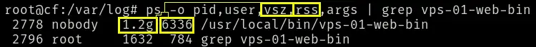

# Go static website/http server generator

generates a ready to deploy on alpine linux (statically linked) go binary that contains both the server and static web assets.

start it using:

```bash
go run builder.go
```

And follow the **TUI** prompts

when providing the path to the web static files, it accepts the relative path.


## compile command (though it actually does the compile for you)

```bash
GOOS=linux GOARCH=amd64 CGO_ENABLED=0 go build -ldflags="-w -s" -o <output name> main.go
```

## upload to server

```bash
scp tusko-web root@<vps-public-ip>:/usr/local/bin/tusko-web
```

## need `libcap` in order to run as `nobody` but bind to a ***priviledged port*** (below **1024**)

```bash
# 1. Install libcap package (provides the setcap utility)
apk add libcap

# 2. Ensure the binary is executable
chmod +x /usr/local/bin/tusko-web

# 3. Apply the network bind capability to the binary
setcap 'cap_net_bind_service=+ep' /usr/local/bin/tusko-web
```

## create rc-service definition at `/etc/init.d/<service name>

```bash
#!/sbin/openrc-run

name="web-server-binary"
description="Go embedded static web server"
command="/usr/local/bin/web-server-binary"
command_background="yes"
pidfile="/run/${name}.pid"
output_log="/var/log/${name}.log"
error_log="/var/log/${name}.err"
command_user="nobody:nobody" 

depend() {
    need net
    after firewall
}
```

## start the service as **root**

```bash
# Ensure log files exist and are writable by nobody
touch /var/log/tusko-web.log /var/log/tusko-web.err
chown nobody:nobody /var/log/tusko-web.log /var/log/tusko-web.err

# Start the service
chmod +x /etc/init.d/<service name>
rc-service <service-name> restart
```

## Interesting Memory behavior

run:

```bash
top
```



When a Go program starts, its runtime environment (which includes the Garbage Collector and the goroutine scheduler) requests a massive, contiguous block of **Virtual Memory** from the Linux kernel upfront.

Go does this to create "memory arenas." By reserving a massive address space early, Go ensures that as the web server handles concurrent requests and spawns goroutines, it can allocate memory instantly without constantly asking the Linux kernel for more space, which would cause fragmentation and latency.

run:

```bash
ps -o pid,user,vsz,rss,args | grep vps-01-web-bin
```



- The **rss** column shows that it's not actually using `1.2g` of memory, just `6336k`, `~6.3m`.

- The tests indicate that this is marginally more memory useage than running **nginx**, so I may switch back, but it works exactly the same, tierhive's HAproxy never knew there was a difference when I did the switch over.


